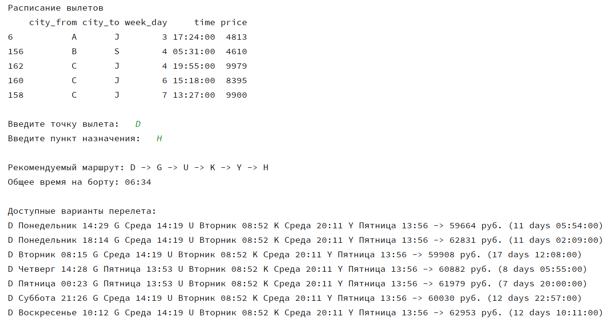

# Поиск оптимального маршрута между городами

### Задача
Создание алгоритма, который принимает на вход стартовую точку и пункт назначения и находит среди всех возможных вариантов кратчайший путь между ними, стоимость и продолжительность перелета с учетом имеющегося расписания.

### Генерация данных
Это учебный проект, поэтому для его реализации были использованы данные, сгенерированные искусственно:
- Идентификаторами городов служат заглавные буквы английского алфавита
- Между 26 городами случайным образом формируется 50 прямых и обратных маршрутов
- Для каждого маршрута формируется условное расписание, структурированное по дням недели (от 1 до 7 вылетов в неделю)
- Стоимость рассчитывается исходя из продолжительности перелета и включает случайную наценку от 1% до 30%

### Пример работы алгоритма

### Дальнейшее использование
Это базовая версия алгоритма, который в дальшейшем планируется использовать как часть веб-приложения. В данный момент скрипт можно запускать в терминале или в консоли.
